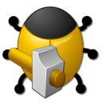
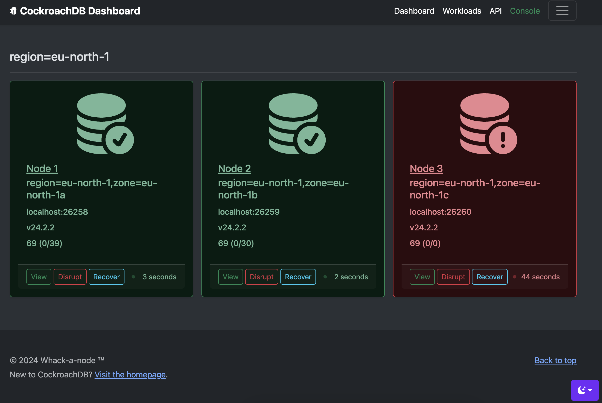

	
	<a href="https://github.com/cloudneutral/whack-a-node/actions/workflows/maven.yml">

<!-- TOC -->
* [About](#about)
  * [Main features](#main-features)
  * [Compatibility](#compatibility)
  * [How it works](#how-it-works)
* [Terms of Use](#terms-of-use)
* [Building](#building-)
  * [Prerequisites](#prerequisites)
  * [Install the JDK](#install-the-jdk)
  * [Clone the project](#clone-the-project)
* [Download artifact](#download-artifact)
* [Configuration](#configuration)
* [Running](#running)
  * [Local Cluster Configuration](#local-cluster-configuration)
  * [CockroachDB Cloud Configuration](#cockroachdb-cloud-configuration)
<!-- TOC -->

# About

 

[Whack-a-node](https://github.com/cloudneutral/whack-a-node) is a simple graphical
and command-line tool for controlling and visualizing CockroachDB cluster failures 
and its impact on application workloads. 

## Main features

The main features include:

- Visualize cluster health in a web UI.
- Visualize client-side workload impact during disruptions.
- Push-button node disruption and recovery.
- Quick, simple deployment and management of local CockroachDB clusters.

Landing page showing the cluster layout and node status:

Listing optional client side mini-workloads against the database:

## Compatibility

This tool supports the following platforms/versions:

- CockroachDB Cloud v22.2+
  - Requires a feature flag enabled for the organization (file a support request) 
- CockroachDB Local Self-Hosted v22.2+
  - Secure or insecure mode
  - No license key needed
- MacOS (main platform)
- Linux

## How it works

Whack-a-node is made of: 

1. A spring-boot web app for the visuals (with a REST API) 
1. Bash scripts for retrieving cluster status and details, causing disruptions, 
recover nodes, etc.
2. Bash scripts for quick and easy installing and configuring of a local CockroachDB cluster.

The command-line bash scripts can be used independently of the web app. 
The web app in turn uses the bash scripts to pass commands to the CockroachDB cluster 
and JDBC to run basic workloads. 

# Terms of Use

This tool is not supported by Cockroach Labs. Use of this tool is entirely at your
own risk and Cockroach Labs makes no guarantees or warranties about its operation.

See [MIT](LICENSE.txt) for terms and conditions.

# Building 

The only building needed is the visualization spring boot app that also 
acts as the control plane and database client.

## Prerequisites

- Java 17+ JDK
    - https://openjdk.org/projects/jdk/17/
    - https://www.oracle.com/java/technologies/downloads/#java17
- Maven 3+ (optional, embedded wrapper available)
    - https://maven.apache.org/

## Install the JDK

MacOS (using sdkman):

    curl -s "https://get.sdkman.io" | bash
    sdk list java
    sdk install java 17.0 (pick version)  

Ubuntu:

    sudo apt-get install openjdk-17-jdk

## Clone the project

    git clone git@github.com:cloudneutral/whack-a-node.git && cd whack-a-node

# Download artifact

If you prefer to use a packaged artifact (release or snapshot) rather than building, 
see [GitHub Packages](https://github.com/cloudneutral/whack-a-node/packages/2285983?version=1.0.0-SNAPSHOT).

Scroll to the current `TAR.GZ` file and copy the download URL, then run:

    curl -o whack-a-node.tar.gz <paste-url-here>
    tar xvf whack-a-node.tar.gz && cd whack-a-node

# Configuration

Every aspect of whack-a-node can be configured through the files available in the `config` directory:

1. [settings-cloud.sh](config/settings-cloud.cfg) - Settings for using an existing CockroachDB Cloud cluster.
1. [settings-insecure.sh](config/settings-insecure.cfg) - Settings for using a local CockroachDB self-hosted cluster in insecure mode.
1. [settings-secure.sh](config/settings-secure.cfg) - Settings for using a local CockroachDB self-hosted cluster in secure mode.
1. [settings-local.sh](config/settings-local.cfg) - Settings for creating and managing a local CockroachDB cluster.
1. [settings-service.sh](config/settings-service.cfg) - Settings for the whack-a-node service.
1. [haproxy.cfg](config/haproxy.cfg) - HAProxy configuration for local CockroachDB cluster.
1. [init.sql](config/init.sql) - Init SQL statements (optional).
  
More details are found in the configuration file comments. 

# Running

These instructions cover creating a local, self-hosted cluster or using CockroachDB Cloud.

## Local Cluster Configuration

1. To get started with a local cluster, run:

       ./cluster-admin 

   Pick option `secure` or `insecure`. Alternatively, edit or delete the existing `settings.cfg`
   and change `DEPLOY_MODE` to `secure|insecure`.

1. (optional) Edit [config/settings-secure.cfg](config/settings-secure.cfg) 
or [config/settings-insecure.cfg](config/settings-insecure.cfg) and change the details if needed.
The default settings are usually sufficient unless you have conflicting 
network ports occupied.

1. (optional) Edit [config/settings-local.cfg](config/settings-local.cfg) to tailor cluster listen ports, 
locality flags etc.

1. (optional) Edit [config/haproxy.cfg](config/haproxy.cfg) to mirror any listen port changes you make. This 
configuration is pre-configured for up to 18 local nodes but HAProxy automatically adjusts to anything less.

1. [Secure mode] Install a CockroachDB binary, start the cluster, load balancer and the app:

       ./cluster-admin install
       ./cluster-admin certs
       ./cluster-admin start-all
       ./cluster-admin init
       ./cluster-admin start-lb
       ./cluster-admin start-service
       ./cluster-admin login
       ./cluster-admin open

1. [Insecure mode] Install a CockroachDB binary, start the cluster, load balancer and the app:

       ./cluster-admin install
       ./cluster-admin start-all
       ./cluster-admin init
       ./cluster-admin start-lb
       ./cluster-admin start-service
       ./cluster-admin open

Run the inverse to shut things down:

    ./cluster-admin stop-service
    ./cluster-admin stop-lb
    ./cluster-admin stop-all

## CockroachDB Cloud Configuration

1. To get started with an existing CockroachDB Cloud cluster, run:
    
       ./cluster-admin 

    Pick option `cloud`. Alternatively, edit or delete the existing `settings.cfg`
    and change `DEPLOY_MODE` to `cloud`.
1. Edit [config/settings-cloud.cfg](config/settings-cloud.cfg) and change the credentials to match your cluster.

    | Key              | Value                                                                                                                                           | Example                                                 |
    |------------------|-------------------------------------------------------------------------------------------------------------------------------------------------|:--------------------------------------------------------|
    | CC_CLUSTERID     | Your cluster UUID, i.e: (https://cockroachlabs.cloud/cluster/<CLUSTER_ID>)                                                                      | (see CC console)                                        | 
    | CC_SSL_ROOT_CERT | The CA root certificate for your [cluster](https://cockroachlabs.cloud/) stored locally.                                                        | (see CC console)                                        | 
    | CC_API_KEY       | Create an [API key](https://www.cockroachlabs.com/docs/cockroachcloud/managing-access#create-api-keys) for the cluster and copy the secret key. | (secret key)                                            | 
    | ADMIN_URL        | DB Console URL.                                                                                                                                 | https://admin-my-cluster-qmg.cockroachlabs.cloud:8080   | 
    | DB_HOST          | Database host name (pick closest region).                                                                                                       | my-cluster-qmg.aws-eu-north-1.cockroachlabs.cloud:26257 | 
    | DB_USER          | Database user name.                                                                                                                             | craig                                                   | 
    | DB_PASSWORD      | Database user password                                                                                                                          | cockroach                                               | 

1. Install a CockroachDB binary, login and start the app:

       ./cluster-admin install
       ./cluster-admin login
       ./cluster-admin start-service
       ./cluster-admin open

---

That is all, carry on!
